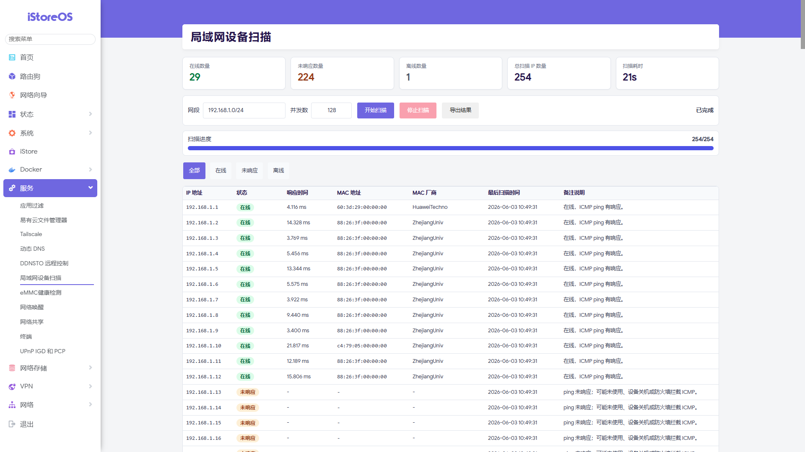

<p align="center">
  
</p>

<h1 align="center">LAN Device Scanner</h1>

<p align="center">
  <b>局域网设备扫描</b> · 适用于 iStoreOS / OpenWrt 的 LuCI 局域网扫描插件
</p>

<p align="center">
  <a href="#功能特性">功能特性</a> ·
  <a href="#界面预览">界面预览</a> ·
  <a href="#安装测试">安装测试</a> ·
  <a href="#编译-ipk">编译 IPK</a> ·
  <a href="#安全说明">安全说明</a>
</p>

---

## 项目简介

**LAN Device Scanner（局域网设备扫描）** 是一个适用于 **iStoreOS / OpenWrt** 的 LuCI 插件，用于按 CIDR 网段扫描局域网内的在线、未响应和离线设备。

插件支持自动识别当前路由器所在的 IPv4 `/24` 网段，也可以手动输入 CIDR 网段，例如 `192.168.0.0/24`。扫描结果会显示 IP 地址、在线状态、响应时间、MAC 地址和主机名，适合用于快速查看局域网设备分布情况。

---

## 界面预览

<p align="center">
  
</p>

---

## 功能特性

- 支持输入 IPv4 CIDR 网段，例如 `192.168.0.0/24`
- 默认自动填入当前路由器 IPv4 所在网络的 `/24` 网段
- 支持一键扫描整个网段内的可用主机地址
- 支持 `/8` 到 `/30` 网段
- 扫描 `/8` 到 `/20` 大网段时，前端会弹出风险确认
- 使用 `ping` 判断设备是否在线
- 通过 `ip neigh`、`/proc/net/arp` 获取 MAC 地址
- 支持保存历史 MAC，用于区分“未响应”和“离线”
- 前端实时显示扫描进度，例如 `20/254`
- 支持筛选：全部、在线、未响应、离线
- 支持导出扫描结果为表格文件
- 后端严格校验 CIDR 输入，避免命令注入

---

## 状态规则

| 状态 | 说明 |
| --- | --- |
| 在线 | 本次 `ping` 有响应 |
| 未响应 | 本次 `ping` 无响应，且没有历史 MAC |
| 离线 | 以前扫描到过 MAC，但本次 `ping` 无响应 |

> 注意：`ping` 不通不一定代表设备真正离线，也可能是 IP 未使用、设备关机，或者设备防火墙拦截了 ICMP。

---

## 项目结构

```text
.
├── Makefile
├── root/usr/share/luci/menu.d/luci-app-lan-scanner.json
├── root/usr/share/rpcd/acl.d/luci-app-lan-scanner.json
├── root/usr/libexec/lan-scanner
├── htdocs/luci-static/resources/view/lan-scanner.js
├── logo.png
├── Screenshot.png
├── README.md
├── LICENSE
└── .gitignore
```

---

## 安装测试

适合开发阶段直接复制文件到 OpenWrt / iStoreOS 设备测试。

```sh
scp -r root/* root@192.168.1.1:/
scp -r htdocs/* root@192.168.1.1:/www/
ssh root@192.168.1.1 'chmod +x /usr/libexec/lan-scanner && /etc/init.d/rpcd restart && /etc/init.d/uhttpd restart'
```

然后进入 LuCI 后台：

```text
服务 / 局域网设备扫描
```

---

## 后端命令测试

```sh
/usr/libexec/lan-scanner start 192.168.0.0/24
/usr/libexec/lan-scanner status <JOB_ID>
/usr/libexec/lan-scanner stop <JOB_ID>
/usr/libexec/lan-scanner history
/usr/libexec/lan-scanner cleanup
```

---

## 编译 IPK

将本仓库放入 OpenWrt SDK 的 `package` 目录，例如：

```sh
cd openwrt-sdk
mkdir -p package/luci-app-lan-scanner
cp -r /path/to/LAN-Scanner/* package/luci-app-lan-scanner/
./scripts/feeds update -a
./scripts/feeds install -a
make menuconfig
```

在菜单中选择：

```text
LuCI -> Applications -> luci-app-lan-scanner
```

开始编译：

```sh
make package/luci-app-lan-scanner/compile V=s
```

生成的 IPK 通常位于：

```text
bin/packages/<target>/base/luci-app-lan-scanner_1.1.0-1_all.ipk
```

---

## 安装 IPK

```sh
scp bin/packages/<target>/base/luci-app-lan-scanner_1.1.0-1_all.ipk root@192.168.1.1:/tmp/
ssh root@192.168.1.1 'opkg install /tmp/luci-app-lan-scanner_1.1.0-1_all.ipk'
```

---

## 运行依赖

- `luci-base`
- `rpcd`
- `ping`：通常由 BusyBox 提供
- `ip`：通常由 BusyBox 或 `ip-full` 提供；缺失时仍会回退读取 `/proc/net/arp`

---

## 安全说明

后端只接受严格的 IPv4 CIDR 格式，且范围限制为 `/8` 到 `/30`。

大网段扫描可能耗时较久，并占用路由器 CPU、内存和 `/tmp` 空间。因此当前端检测到 `/8` 到 `/20` 网段时，会要求用户再次确认。

所有命令调用均使用独立参数传递，不拼接用户输入执行 shell 命令，以降低命令注入风险。

---

## 许可证

本项目遵循仓库内 `LICENSE` 文件所声明的开源许可证。
